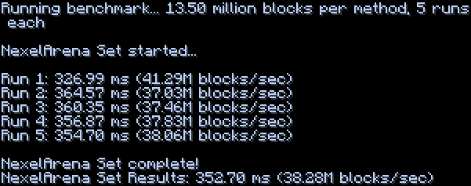
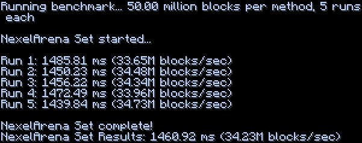
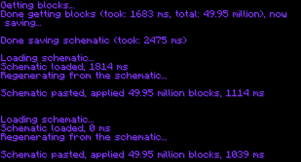

# NexelArena

**NexelArena** is an **INSANELY fast**, fully **asynchronous arena regenerator**.

> ⚠ **PaperMC ONLY** — This will **NOT** work on Spigot or non-Paper forks!

---

## Features

- **Blazing Fast Performance**:
    - 10 million blocks in around **400 milliseconds**.

- **Zero Dependencies**:
    - No WorldEdit.
    - No FAWE.
    - Just drop it in.

- **Async Pasting**:
    - **Fully** asynchronous schematic pasting.
    - No lag, even during large arena resets.

---

## Installation

1. Download the NexelArena plugin.
2. Drop it into your server's `/plugins/` folder.
3. Restart your server (you can reload as well, though not really recommended).

---

## Benchmarks

> Below is **NexelArena** setting **300x150x300** (\~14 million blocks):
>

> Below is **NexelArena** setting **500x200x500** (\~50 million blocks):
>

> Below is **NexelArena** Below is NexelArena saving a schematic of 50 million blocks, loading it, pasting it, loading
> it again (from cache), and then pasting it once more:
>

> **Note**: While this may look like it takes "a lot" of time, the reality is that it **does NOT** lag your server at
> all. Even when setting **50 million blocks**, the **maximum MSPT increase** is only around **0.2** (since it runs
> asynchronously).
>
> Benchmarks were performed on a **Ryzen 7 3700X**, using **[Leaf](https://github.com/Winds-Studio/Leaf) 1.21.4**,
> actual results may vary based on your hardware.
---

## Usage

Commands, config details, and API are coming soon.

---

## To Do

- Add automatic arena regeneration.
- Create an API for developers.
- Create an actual arena system (rather files based).
- More features